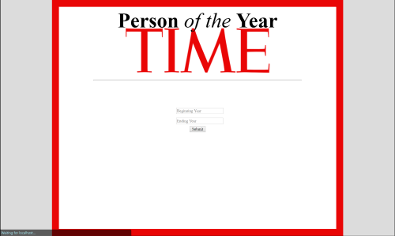

# Person of the Year

This web application is an exercise in the .NET Core MVC architecture.

Within this app, users can select a time frame from which to display TIME magazine's Person of the Year
recipient.

## Visual

## Usage

Clone this repository to local files.

Open Visual Studio

File > Open > Project/Solution

Navigate to where you saved this Repo in your local files

Open the "My_First_MVC_App.sln" file

In the top menu, Click the IIS Express Button

A browser window should open,

Enter beginning and ending search years and hit submit.

